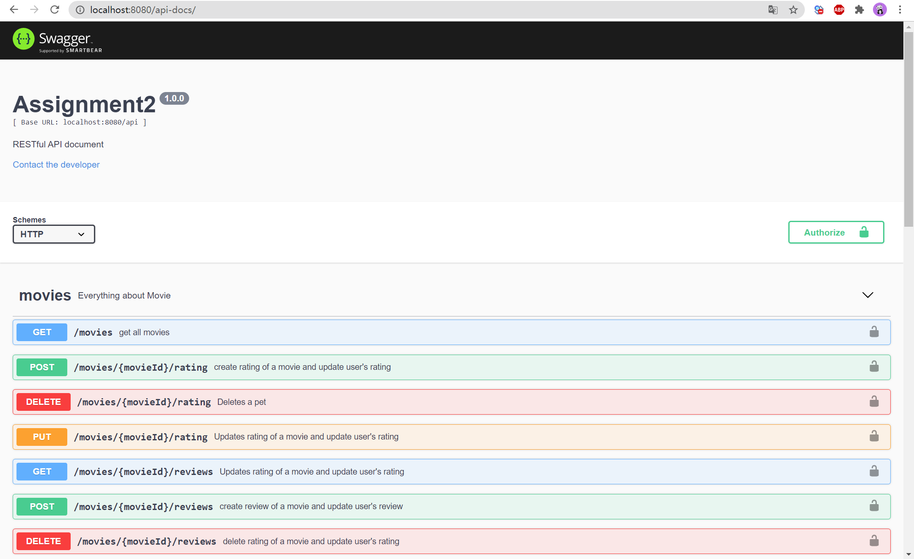
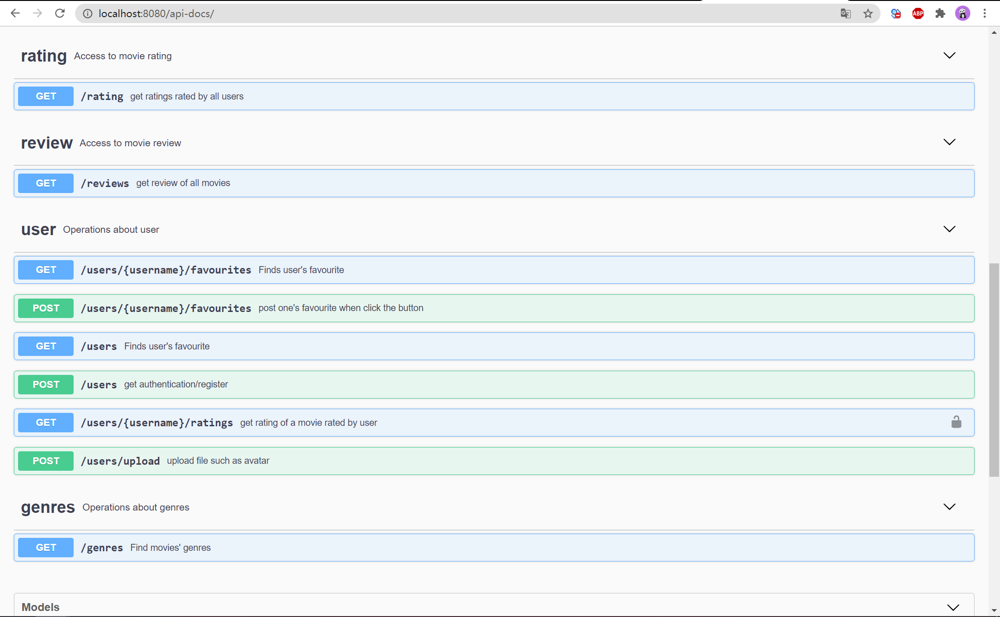
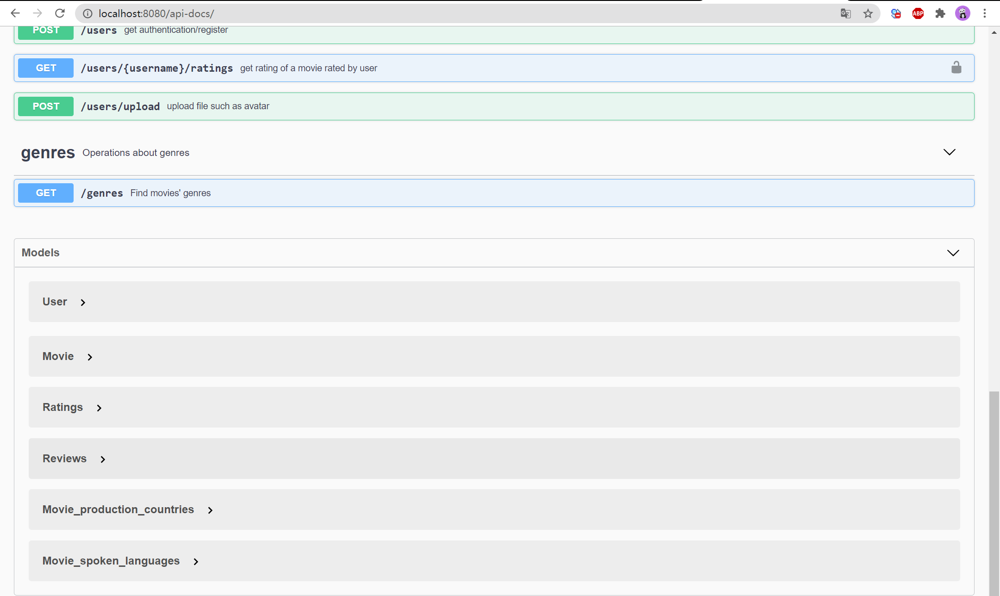
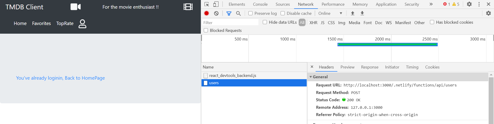
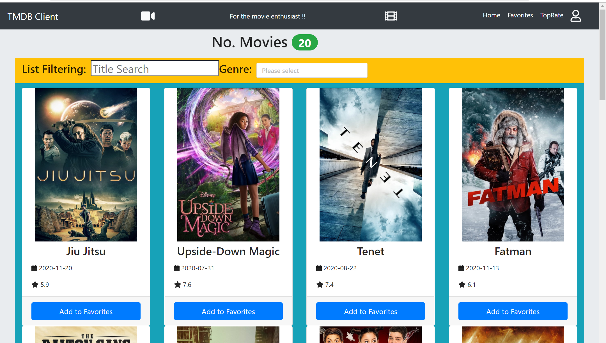
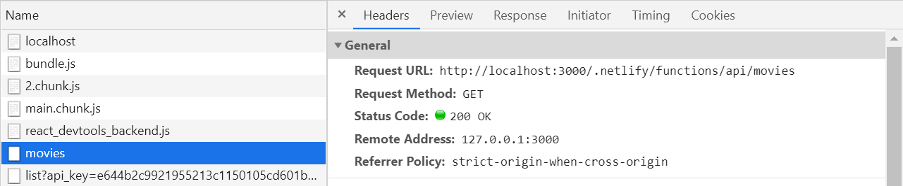
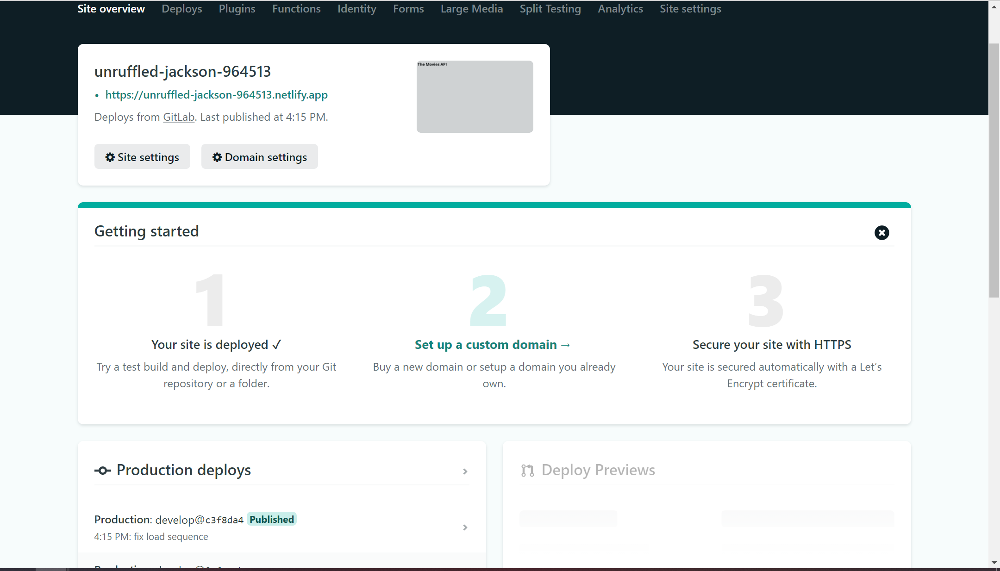
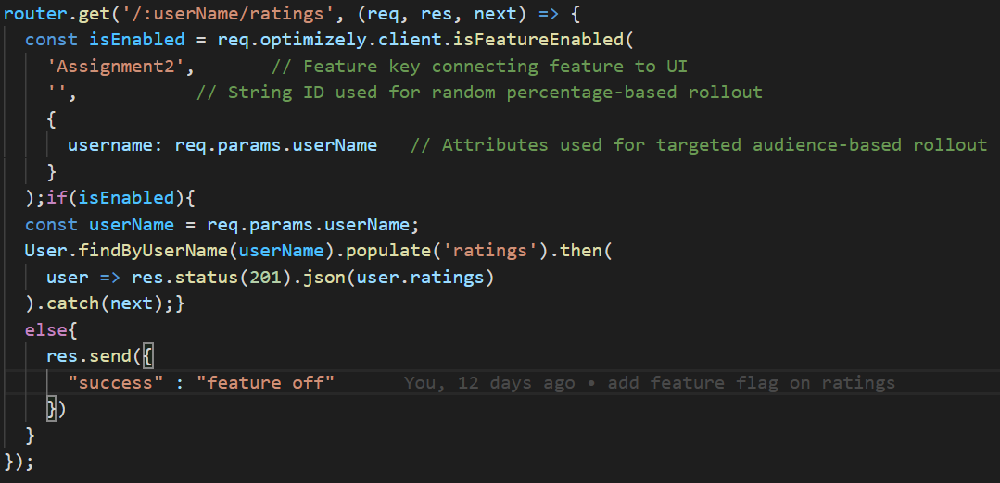
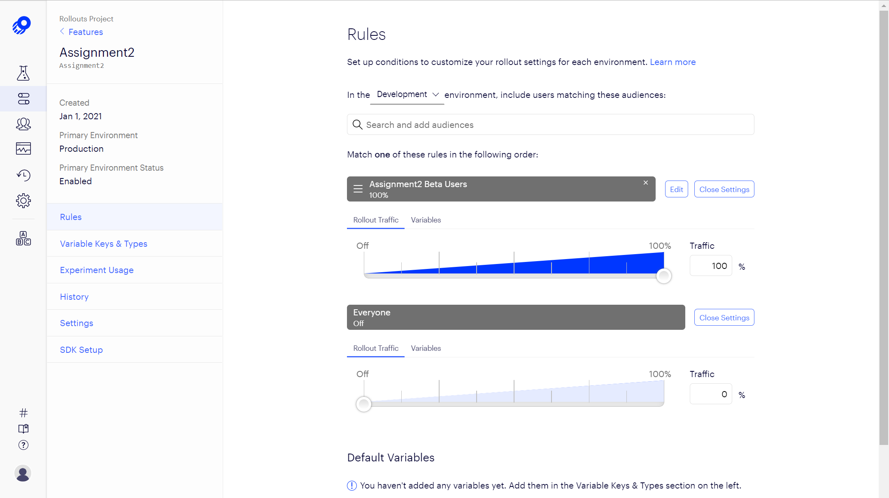

# Assignment 2 - Web API.

Name: xiaofeng gong

## Features.

 + rating -user can rate a movie(full CURD), the record can be traced in user api and be seen in movie api ratings. Both referencing User and movie objects. (Custom validation using Mongoose)
 + reviews - provide a set of reviews of different movies, user can CURD  the review of a movie.Both referencing User and movie objects. (Custom validation using Mongoose)
 + Integration - integrated with assignment1
 + error handling - errorNotification (notifier)
 + upload - user can upload a file(size limited to 1.6MB) and the backend can store and read file.(based on multer) 
 + Error handling - better error handling by using notifier
 + mail - the express can send email to user's email address for verification when authenticating.(based on nodemailer) 
 + logging - record requests and save in local storage based on morgan
 + Swagger - API documentation
 + Advanced authentication - authenticate with email and realize protect routes
 + xoauth2 - a way to authenticate
 + Helmet - encrypt the request headers
 + Moment - manipulate date and time
 + netlify-lambda - serverless function
 + hosting - netlify deployment
 + recommend movies- provide a set of movies recommend according to user's favourite movies based on collaborative filtering

## Installation Requirements

download:

```bat
git clone https://github.com/copyninnja/web-assignment2-backend.git
```

followed by installation:

```bat
npm install
npm run build
npm start
```

## API Configuration

creating an ``.env`` and what variables to put in it. 

```bat
NODE_ENV=development
PORT=9000
HOST=localhost
MONGO_DB=YourMongoURL
SEED_DB=true
secret=YourJWTSecret
TMDB_KEY=key
TOKEN=1
MailPassword=yourEmailaccessToken
```


## API Design

https://app.swaggerhub.com/apis/copyninnja/assignment/1.0.0






## Security and Authentication


The authentication is implemented through passport and verified by JWTtoken.

All the api/movies/xxxxxx are protected , users must post their information for verification and use the response token as their authorization token.


## Integrating with React App

github-frontend-address:https://github.com/copyninnja/web-assignment2-front.git

The front-end can send user authentication and registration to user api and gain a bear token. Then, the front-end can have access to movies and other protected routes. 

~~~Javascript
export const getMovies = () => {
  return fetch(
    `/.netlify/functions/api/movies`,{headers: {
      'Authorization': window.localStorage.getItem('token')
   }
 }
 ).then(res => res.json())
 .then()
};
export const login = (username, password) => {
  return fetch('/.netlify/functions/api/users', {
      headers: {
          'Content-Type': 'application/json'
      },
      method: 'post',
      body: JSON.stringify({ username: username, password: password })
  }).then(res => res.json())
};

~~~








## Extra features

 + upload - user can upload a file(size limited to 1.6MB) and the backend can store and read file.(based on multer) 
 + Error handling - better error handling by using notifier
 + mail - the express can send email to user's email address for verification when authenticating.(based on nodemailer) 
 + logging - record requests and save in local storage based on morgan
 + error handling - errorNotification (notifier)
 + Swagger - API documentation
 + Helmet - encrypt the request headers
 + Moment - manipulate date and time
 + Advanced authentication - authenticate with email and realize protect routes
 + xoauth2 - a way to authenticate
 + netlify-lambda - serverless function
 + hosting - netlify deployment
 + recommend - provide a set of movies recommend according to user's favourite movies based on collaborative filtering

## Independent learning.

serverless functions - a way of deploying express api that allows no port listening 

movie recommender - an algorithm that extract the users share the favourite movies and populate the movies


# Assignment 2 - Agile Software Practice.

Name: xiaofeng gong

## Target Web API.

+ Get /api/movies - returns an array of movie objects.
+ Get /api/movies/:id - returns detailed information on a specific movie.
+ Get /api/genres - returns different information on genres
+ Post /api/users/:username/favourites - add a movie to user's favourite
+ Get /api/users/:username/favourites - return an array of user's favourite movies
+ Get /api/users - return an array of all the users with detailed information
+ Post /api/users - authenticate the user and password in the body , return a Bear token. To visit protected routes , request must carry a bear token in authorization.
+ Post /api/users?action=register - register a new user with the username ,password and email in the body. The system will send a verification email to the email address.
+  Post /api/movies/:movieid/rating - post a rating to the movie by the user(verified by authorization token)
+  Get /api/users/:username/rating - return the rated  movies and rate by the user
+ Delete /api/movies/:movieis/rating - delete the user's rating on a specific movie.
+ Put /api/movies/:movieid/rating - update the movie's rate, modify the modified time
+ Get /api/reviews - return all the reviews
+ Get /api/movies/:movieid/reviews - get reviews of the movie
+ Post /api/movies/:movieid/reviews - add a review to the movie
+ Get /api/users/:username/reviews - return all the reviews written by the user
+ Put /api/movies/:movieid/reviews - update the review
+ Delete /api/movies/:movieid/reviews - delete the user's review of the movie
+ Post  /api/users/upload - upload document such as png(size limit to 1.6mb)
+ Get /api/users/:username/recommendMovies - get a few recommend movie by collaborative filtering based on favourite movies

## Error/Exception Testing.

+ Post /api/movies - test when the new movie has no title, invalid release date, empty genre list. Test adding a movie without prior authentication. See tests/functional/api/movies/index.js 
+ Get /api/movies - test when visiting protected api without prior authentication.See tests\functional\api\movies\index.js
+ Get /api/movies/:movieid - test when fetching a non-existing movie's detail .See tests\functional\api\movies\index.js
+ POST /api/movies/:movieid/rating - test when rating a non-existing movie.See tests\functional\api\movies\index.js
+ Put /api/movies/:movieid/rating - test when updating rate of  a non-existing movie.See tests\functional\api\movies\index.js
+ Delete /api/movies/:movieid/rating - test when deletingrate of  a non-existing movie.See tests\functional\api\movies\index.js
+ POST /api/users?action=register - test register a new user without password, invalid password.See tests\functional\api\users\index.js
+ POST /api/users - test when authenticating with mismatch username, mismatch password  .See tests\functional\api\users\index.js
+ POST /api/users/:username/favourites - test when adding non-existing movies  .See tests\functional\api\users\index.js

## Continuous Delivery/Deployment.

+ [https://laughing-wescoff-ebc91f.netlify.app](https://laughing-wescoff-ebc91f.netlify.app/) - Staging deployment
+ [https://unruffled-jackson-964513.netlify.app](https://unruffled-jackson-964513.netlify.app/)- Production

netlify serverless Delivery/Deployment:

+ Staging app overview 


+ Production app overview 



## Feature Flags (If relevant)

- /api/:userName/ratings - only the allowed users can access this functionality






